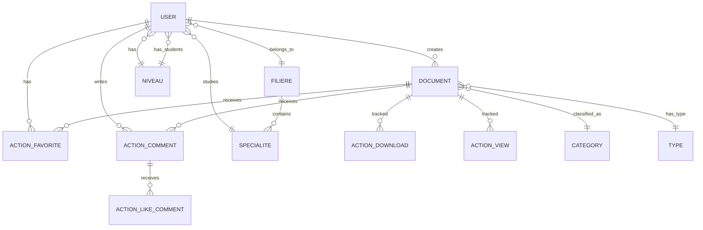

# 📚 DocSchool - Plateforme Académique Collaborative

<div align="center">
  
  
  
  
  
</div>

---

## 🚀 **Vue d'ensemble**

DocSchool est une plateforme web entreprise de gestion et partage de documents académiques, développée avec une architecture moderne Django REST API + React. Elle permet aux institutions éducatives de centraliser, organiser et distribuer efficacement leurs ressources pédagogiques avec des fonctionnalités d'intelligence artificielle intégrées.

### 🎯 **Valeur Métier**
- **Centralisation** des ressources académiques
- **Collaboration** entre étudiants et enseignants  
- **Intelligence Artificielle** pour l'assistance pédagogique
- **Analytics** détaillés sur l'utilisation
- **Sécurité** et contrôle d'accès avancés

---

## 🏗️ **Architecture Technique**

### **Structure du Projet**
```
DocSchool/
├── 📁 docschool-backend/          # API REST Django
│   ├── 🔐 core/                   # Authentification & Utilisateurs
│   ├── 📄 ajoutDocument/          # Gestion Documents
│   ├── ⚡ ActionDocument/         # Actions Utilisateurs
│   ├── ⚙️ backend/               # Configuration
│   └── 📦 media/                 # Stockage Fichiers
└── 📁 docschool-frontend/        # Interface React
    ├── 🎨 src/components/        # Composants UI
    ├── 📱 src/pages/            # Vues Applicatives
    ├── 🔌 src/services/         # Services API
    └── 🎯 src/contexts/         # État Global
```

### **Stack Technologique**

| Couche | Technologie | Version | Usage |
|--------|-------------|---------|--------|
| **Backend** | Django | 5.2.5 | Framework principal |
| **API** | Django REST Framework | 3.15.2 | API RESTful |
| **Frontend** | React | 18.2.0 | Interface utilisateur |
| **Base de données** | PostgreSQL | 12+ | Persistance |
| **Authentification** | JWT | Simple JWT 5.3.0 | Sécurité |
| **IA** | GroqCloud API | - | Assistant intelligent |
| **Bundler** | Vite | 5.2.0 | Build & Dev |

---

## 📋 **Prérequis Système**

### **Environnement de Développement**
| Composant | Version Minimale | Version Recommandée |
|-----------|------------------|---------------------|
| Python | 3.8+ | 3.11+ |
| Node.js | 16+ | 18+ |
| npm | 8+ | 9+ |
| PostgreSQL | 12+ | 15+ |
| RAM | 4GB | 8GB+ |
| Stockage | 5GB | 10GB+ |

### **Environnement de Production**
- **Serveur** : Linux Ubuntu 20.04+ ou CentOS 8+
- **RAM** : 8GB minimum, 16GB recommandé
- **CPU** : 4 cœurs minimum
- **Stockage** : SSD 50GB+ avec backup
- **SSL** : Certificat valide requis

---

## 🚀 **Guide d'Installation**

### **1. Configuration de l'Environnement**

```bash
# Clonage du repository
git clone https://github.com/votre-organisation/docschool.git
cd docschool

# Vérification des versions
python --version  # Doit être >= 3.8
node --version    # Doit être >= 16
psql --version    # Doit être >= 12
```

### **2. Installation Backend (Django)**

```bash
# Navigation vers le backend
cd docschool-backend

# Création de l'environnement virtuel
python -m venv .venv

# Activation de l'environnement
# Windows
.venv\Scripts\activate
# Linux/macOS
source .venv/bin/activate

# Mise à jour pip
python -m pip install --upgrade pip

# Installation des dépendances
pip install -r requirements.txt
```

### **3. Configuration Base de Données**

```sql
-- Connexion PostgreSQL en tant que superutilisateur
sudo -u postgres psql

-- Création de la base de données
CREATE DATABASE docschool;
CREATE USER docschool_user WITH ENCRYPTED PASSWORD 'your_secure_password';
GRANT ALL PRIVILEGES ON DATABASE docschool TO docschool_user;
ALTER USER docschool_user CREATEDB;
\q
```

### **4. Variables d'Environnement**

Créez le fichier `.env` dans `docschool-backend/` :

```env
# ===============================
# CONFIGURATION BASE DE DONNÉES
# ===============================
DB_NAME=docschool
DB_USER=docschool_user  
DB_PASSWORD=your_secure_password
DB_HOST=localhost
DB_PORT=5432

# ===============================
# CONFIGURATION EMAIL
# ===============================
EMAIL_HOST=smtp.gmail.com
EMAIL_PORT=587
EMAIL_USE_TLS=True
EMAIL_HOST_USER=your_email@company.com
EMAIL_HOST_PASSWORD=your_app_password
DEFAULT_FROM_EMAIL=noreply@docschool.com

# ===============================
# CONFIGURATION IA
# ===============================
GROQ_API_KEY=your_groq_api_key_here

# ===============================
# CONFIGURATION SÉCURITÉ
# ===============================
SECRET_KEY=your_django_secret_key_here
DEBUG=False
ALLOWED_HOSTS=localhost,127.0.0.1,yourdomain.com

# ===============================
# CONFIGURATION STOCKAGE
# ===============================
MEDIA_ROOT=/path/to/media/files
STATIC_ROOT=/path/to/static/files
```

### **5. Migration et Initialisation**

```bash
# Application des migrations
python manage.py makemigrations core
python manage.py makemigrations ajoutDocument  
python manage.py makemigrations ActionDocument
python manage.py migrate

# Création du superutilisateur
python manage.py createsuperuser

# Collecte des fichiers statiques
python manage.py collectstatic --noinput

# Test du serveur
python manage.py runserver
```

### **6. Installation Frontend (React)**

```bash
# Navigation vers le frontend
cd ../docschool-frontend

# Installation des dépendances
npm install

# Installation des dépendances spécifiques manquantes
npm install axios react-router-dom react-toastify
npm install pdfjs-dist react-markdown
npm install lucide-react

# Vérification des dépendances
npm list --depth=0
```

### **7. Configuration Frontend**

Créez le fichier `.env` dans `docschool-frontend/` :

```env
# ===============================
# CONFIGURATION API
# ===============================
VITE_API_BASE_URL=http://localhost:8000/api
VITE_MEDIA_URL=http://localhost:8000/media

# ===============================
# CONFIGURATION ENVIRONNEMENT
# ===============================
VITE_NODE_ENV=development
VITE_APP_NAME=DocSchool
VITE_APP_VERSION=1.0.0

# ===============================
# CONFIGURATION FEATURES
# ===============================
VITE_ENABLE_AI_CHAT=true
VITE_ENABLE_ANALYTICS=true
```

### **8. Lancement de l'Application**

```bash
# Terminal 1 - Backend
cd docschool-backend
source .venv/bin/activate  # Linux/macOS
# .venv\Scripts\activate   # Windows
python manage.py runserver 0.0.0.0:8000

# Terminal 2 - Frontend  
cd docschool-frontend
npm run dev
```

**🌐 Accès à l'application :**
- Frontend : http://localhost:5173
- Backend API : http://localhost:8000/api
- Admin Django : http://localhost:8000/admin

---

## 📦 **Dépendances Détaillées**

### **Backend - requirements.txt**
```txt
# ===============================
# FRAMEWORK CORE
# ===============================
Django==5.2.5
djangorestframework==3.15.2
djangorestframework-simplejwt==5.3.0

# ===============================
# BASE DE DONNÉES
# ===============================
psycopg2-binary==2.9.9

# ===============================
# CORS & SÉCURITÉ
# ===============================
django-cors-headers==4.3.1

# ===============================
# GESTION MÉDIAS
# ===============================
Pillow==10.4.0
PyPDF2==3.0.1

# ===============================
# CONFIGURATION & UTILS
# ===============================
python-decouple==3.8
python-dotenv==1.0.0

# ===============================
# PRODUCTION
# ===============================
gunicorn==21.2.0
whitenoise==6.6.0
```

### **Frontend - package.json**
```json
{
  "name": "docschool-frontend",
  "version": "1.0.0",
  "private": true,
  "type": "module",
  "scripts": {
    "dev": "vite",
    "build": "vite build",
    "preview": "vite preview",
    "lint": "eslint . --ext js,jsx --report-unused-disable-directives --max-warnings 0",
    "lint:fix": "eslint . --ext js,jsx --fix",
    "test": "vitest",
    "test:coverage": "vitest --coverage"
  },
  "dependencies": {
    "react": "^18.2.0",
    "react-dom": "^18.2.0",
    "react-router-dom": "^6.26.0",
    "axios": "^1.11.0",
    "pdfjs-dist": "^3.11.174",
    "react-markdown": "^10.1.0",
    "react-toastify": "^11.0.5",
    "lucide-react": "^0.263.1"
  },
  "devDependencies": {
    "@types/react": "^18.2.66",
    "@types/react-dom": "^18.2.22",
    "@vitejs/plugin-react": "^4.2.1",
    "eslint": "^8.57.0",
    "eslint-plugin-react": "^7.34.1",
    "eslint-plugin-react-hooks": "^4.6.0",
    "eslint-plugin-react-refresh": "^0.4.6",
    "vite": "^5.2.0",
    "vitest": "^0.34.6"
  }
}
```

---

## 🔗 **Documentation API**

### **Endpoints d'Authentification**
| Méthode | Endpoint | Description | Payload |
|---------|----------|-------------|---------|
| `POST` | `/api/login/` | Connexion utilisateur | `{email, password}` |
| `POST` | `/api/token/refresh/` | Rafraîchir token JWT | `{refresh}` |
| `POST` | `/api/users/` | Inscription utilisateur | `{email, password, ...}` |

### **Endpoints de Gestion Académique**
| Méthode | Endpoint | Description | Autorisation |
|---------|----------|-------------|-------------|
| `GET` | `/api/filieres/` | Liste des filières | Authentifié |
| `GET` | `/api/niveaux/` | Liste des niveaux | Authentifié |
| `GET` | `/api/specialites/` | Liste des spécialités | Authentifié |
| `POST` | `/api/filieres/` | Créer filière | Admin |

### **Endpoints de Documents**
| Méthode | Endpoint | Description | Autorisation |
|---------|----------|-------------|-------------|
| `GET` | `/api/documents/` | Liste paginée des documents | Authentifié |
| `POST` | `/api/documents/` | Upload nouveau document | Authentifié |
| `GET` | `/api/documents/{id}/` | Détail d'un document | Authentifié |
| `PUT` | `/api/documents/{id}/` | Modifier document | Propriétaire/Admin |
| `DELETE` | `/api/documents/{id}/` | Supprimer document | Propriétaire/Admin |
| `GET` | `/api/documents/public/` | Documents publics approuvés | Public |
| `POST` | `/api/documents/{id}/ask/` | Question IA sur document | Authentifié |

### **Endpoints d'Actions Utilisateurs**
| Méthode | Endpoint | Description | Autorisation |
|---------|----------|-------------|-------------|
| `POST` | `/api/action/favoris/toggle-favori/` | Basculer favori | Authentifié |
| `GET` | `/api/action/favoris/mes-favoris/` | Mes documents favoris | Authentifié |
| `POST` | `/api/action/commentaires/ajouter/` | Ajouter commentaire | Authentifié |
| `POST` | `/api/action/telechargements/enregistrer-telechargement/` | Log téléchargement | Authentifié |

---

## 🗄️ **Modèle de Données**

### **Diagramme Entité-Relation**



### **Modèles Principaux**

**User (Utilisateur)**
```python
class User(AbstractUser):
    email = EmailField(unique=True)  # Identifiant principal
    role = CharField(choices=ROLE_CHOICES)  # ETUDIANT, ADMIN
    filiere = ForeignKey(Filiere)
    niveau = ForeignKey(Niveau)  
    specialite = ForeignKey(Specialite)
    matricule = CharField(unique=True)  # Auto-généré
    photo_profil = ImageField()
    date_inscription = DateTimeField(auto_now_add=True)
```

**Document**
```python
class Document(Model):
    titre = CharField(max_length=200)
    description = TextField()
    fichier = FileField(upload_to='documents/')
    auteur = ForeignKey(User)
    filiere = ForeignKey(Filiere)
    specialite = ForeignKey(Specialite) 
    categorie = ForeignKey(CategorieDocument)
    type_document = ForeignKey(TypeDocument)
    statut = CharField(choices=STATUT_CHOICES)  # EN_ATTENTE, APPROUVE, REJETE
    date_creation = DateTimeField(auto_now_add=True)
    nb_vues = IntegerField(default=0)
    nb_telechargements = IntegerField(default=0)
```

---

## 🎨 **Guide de Style & UI Components**

### **Système de Design**

**Palette de Couleurs**
```css
:root {
  /* Couleurs Primaires */
  --primary-blue: #4285f4;
  --primary-blue-dark: #3367d6;
  --primary-orange: #ff8c42;
  
  /* Couleurs Neutres */
  --gray-50: #f8f9fa;
  --gray-100: #f1f3f4;
  --gray-900: #1a1a1a;
  
  /* États */
  --success: #34a853;
  --warning: #fbbc04;
  --error: #ea4335;
}
```

**Typographie**
```css
/* Système typographique */
.typography-h1 { font-size: 2.5rem; font-weight: 700; line-height: 1.2; }
.typography-h2 { font-size: 2rem; font-weight: 600; line-height: 1.3; }
.typography-body { font-size: 1rem; font-weight: 400; line-height: 1.5; }
.typography-caption { font-size: 0.875rem; font-weight: 500; line-height: 1.4; }
```

### **Composants Réutilisables**

**Cards de Documents**
- Design modern avec animations hover
- Skeleton loading intégré
- États favoris avec animations
- Responsive design

**Navigation & Filtres**
- Barres de catégories scrollables
- Pagination avancée
- États actifs/inactifs

**Modales & Sidebars**
- Overlay avec blur background
- Animations d'entrée/sortie fluides
- Gestion du focus accessible

---

## 🔒 **Sécurité & Conformité**

### **Authentification & Autorisation**
- **JWT Tokens** avec expiration configurable
- **Refresh tokens** pour session persistante  
- **Role-based access control** (RBAC)
- **Password policies** renforcées

### **Sécurité des Données**
- **Validation** côté serveur systématique
- **Sanitisation** des inputs utilisateurs
- **File upload** sécurisé avec validation MIME
- **Rate limiting** sur les APIs critiques

### **Protection Applicative**
- **CORS** configuré strictement
- **CSRF** protection activée
- **XSS** protection via CSP headers
- **HTTPS** obligatoire en production

### **Conformité RGPD**
- **Consentement** utilisateur tracké
- **Droit à l'oubli** implémenté
- **Export données** personnelles
- **Logs d'audit** complets

---

## 📊 **Monitoring & Analytics**

### **Métriques Applicatives**
```python
# Exemples de métriques trackées
- Nombre d'utilisateurs actifs (DAU/MAU)
- Documents uploadés/téléchargés par période
- Taux d'engagement par filière
- Performance des requêtes IA
- Temps de réponse API moyen
```

### **Tableau de Bord Admin**
- **Statistiques** en temps réel
- **Gestion utilisateurs** avancée
- **Modération** des contenus
- **Analytics** détaillés

---

## 🚦 **Tests & Qualité**

### **Backend Testing**
```bash
# Tests unitaires Django
python manage.py test

# Coverage report
coverage run --source='.' manage.py test
coverage report -m
coverage html
```

### **Frontend Testing**
```bash
# Tests unitaires React
npm run test

# Tests E2E
npm run test:e2e

# Coverage
npm run test:coverage
```

### **Quality Assurance**
```bash
# Linting Backend
flake8 .
black --check .
isort --check-only .

# Linting Frontend  
npm run lint
npm run lint:fix
```

---

## 🚀 **Déploiement Production**

### **Containerisation Docker**

**Dockerfile Backend**
```dockerfile
FROM python:3.11-slim

WORKDIR /app
COPY requirements.txt .
RUN pip install --no-cache-dir -r requirements.txt

COPY . .
EXPOSE 8000

CMD ["gunicorn", "--bind", "0.0.0.0:8000", "backend.wsgi:application"]
```

**docker-compose.yml**
```yaml
version: '3.8'

services:
  db:
    image: postgres:15
    environment:
      POSTGRES_DB: docschool
      POSTGRES_USER: docschool_user
      POSTGRES_PASSWORD: ${DB_PASSWORD}
    volumes:
      - postgres_data:/var/lib/postgresql/data

  backend:
    build: ./docschool-backend
    environment:
      - DATABASE_URL=postgresql://docschool_user:${DB_PASSWORD}@db:5432/docschool
    depends_on:
      - db
    volumes:
      - media_files:/app/media

  frontend:
    build: ./docschool-frontend
    ports:
      - "80:80"
    depends_on:
      - backend

volumes:
  postgres_data:
  media_files:
```

### **Configuration Nginx**
```nginx
server {
    listen 80;
    server_name docschool.company.com;
    return 301 https://$host$request_uri;
}

server {
    listen 443 ssl http2;
    server_name docschool.company.com;
    
    ssl_certificate /path/to/ssl/cert.pem;
    ssl_certificate_key /path/to/ssl/private.key;
    
    location / {
        proxy_pass http://frontend:3000;
        proxy_set_header Host $host;
        proxy_set_header X-Real-IP $remote_addr;
    }
    
    location /api/ {
        proxy_pass http://backend:8000;
        proxy_set_header Host $host;
        proxy_set_header X-Real-IP $remote_addr;
    }
    
    location /media/ {
        alias /var/www/media/;
        expires 7d;
        add_header Cache-Control "public, immutable";
    }
}
```

---

## 🐛 **Troubleshooting & Support**

### **Problèmes Fréquents**

| Problème | Solution | Priorité |
|----------|----------|----------|
| **Erreur DB Connection** | Vérifier credentials `.env` | 🔴 Critique |
| **CORS Error Frontend** | Configurer `CORS_ALLOWED_ORIGINS` | 🟡 Important |
| **Upload File Failed** | Vérifier permissions dossier `media/` | 🟡 Important |
| **JWT Token Invalid** | Régénérer secret key Django | 🔴 Critique |
| **AI Chat Not Working** | Vérifier `GROQ_API_KEY` | 🟢 Mineur |

### **Logs & Debugging**

```bash
# Logs Backend
tail -f logs/django.log

# Logs Base de données  
sudo tail -f /var/log/postgresql/postgresql-15-main.log

# Monitoring système
htop
iostat -x 1
```

### **Support Entreprise**

📧 **Email** : support-technique@docschool.com
📞 **Téléphone** : +33 1 XX XX XX XX
🎫 **Tickets** : https://support.docschool.com
📚 **Documentation** : https://docs.docschool.com

**SLA de Support :**
- **Critique** : < 2 heures
- **Important** : < 8 heures  
- **Mineur** : < 24 heures

---

## 📈 **Roadmap & Évolutions**

### **Version 2.0 - Q2 2025**
- [ ] **Dashboard Analytics** avancé
- [ ] **API v2** avec GraphQL
- [ ] **Mobile App** native (iOS/Android)
- [ ] **Integration SSO** (LDAP/OAuth2)

### **Version 2.5 - Q3 2025**
- [ ] **AI Recommendations** personnalisées
- [ ] **Collaborative Editing** en temps réel
- [ ] **Video Streaming** intégré
- [ ] **Multi-tenant** architecture

### **Version 3.0 - Q4 2025**
- [ ] **Microservices** architecture
- [ ] **Kubernetes** déploiement
- [ ] **Machine Learning** avancé
- [ ] **White-label** solution

---

## 👥 **Équipe & Contributions**

### **Core Team**
- **Lead Developer** : Responsable architecture & développement
- **DevOps Engineer** : Infrastructure & déploiement  
- **UI/UX Designer** : Interface & expérience utilisateur
- **Product Owner** : Vision produit & roadmap

### **Contribution Guidelines**

```bash
# Workflow de contribution
1. Fork le repository
2. Créer une branche feature
git checkout -b feature/nouvelle-fonctionnalite

3. Développer et tester
npm test
python manage.py test

4. Commit avec message conventionnel
git commit -m "feat: ajout système notifications"

5. Push et créer Pull Request
git push origin feature/nouvelle-fonctionnalite
```

### **Code Review Process**
1. **Automated Tests** doivent passer
2. **Code Quality** gate respecté
3. **Security Scan** validé
4. **2 Reviews** minimum requis
5. **Documentation** mise à jour

---

## 📄 **Licence & Propriété Intellectuelle**

```
Copyright © 2025 DocSchool Enterprise Solutions

LICENCE PROPRIÉTAIRE - TOUS DROITS RÉSERVÉS

Ce logiciel et sa documentation sont la propriété exclusive de 
DocSchool Enterprise Solutions. Toute reproduction, distribution, 
modification ou utilisation non autorisée est strictement interdite 
et peut faire l'objet de poursuites judiciaires.

Pour toute demande de licence d'utilisation :
📧 licensing@docschool.com

```

---

## 📞 **Contact & Support**

<div align="center">

### **DocSchool Enterprise Solutions**

🌐 **Website** : [www.docschool.com](https://www.docschool.com)  
📧 **Email** : contact@docschool.com  
 

---

*Développé par 💙 Galley Nelson*

</div>